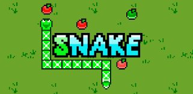
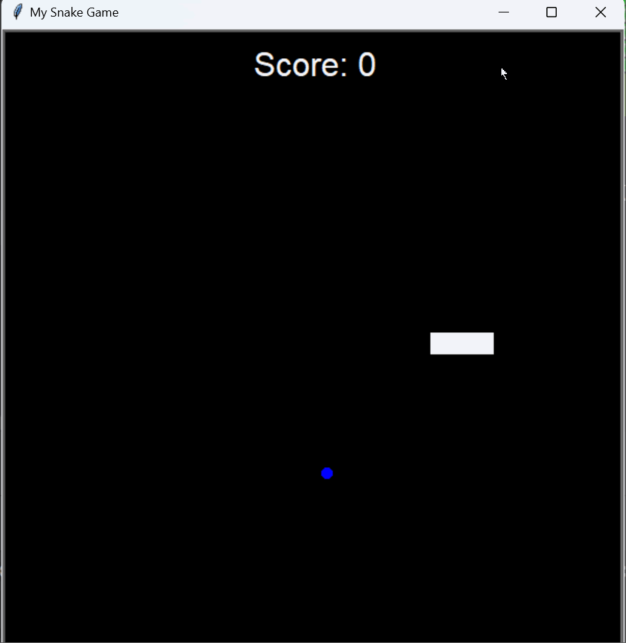

<!-- HEADER -->

<h1 align="center">Snake Game in Python</h1>

<!-- TABLE OF CONTENTS -->
<h2 id="table-of_contents">Table of Contents</h2>

Table of Contents

<ol>
<li><a href="#about-the-project">About the Project</a></li>
</ol>

<h2 id="about-the-project">About the Project</h2>

The Snake game is a classic arcade game that originated in the 1970s and became popular on early mobile phones in the late 1990s. In the game, the player controls a snake that moves around a confined space, usually a grid or a screen. The objective is to eat food items that appear randomly on the screen, which causes the snake to grow longer. The game ends if the snake runs into the walls, itself, or any other obstacles. The challenge is to keep the snake moving and growing without crashing into anything. The simplicity and addictive nature of the game have made it a timeless favorite.

